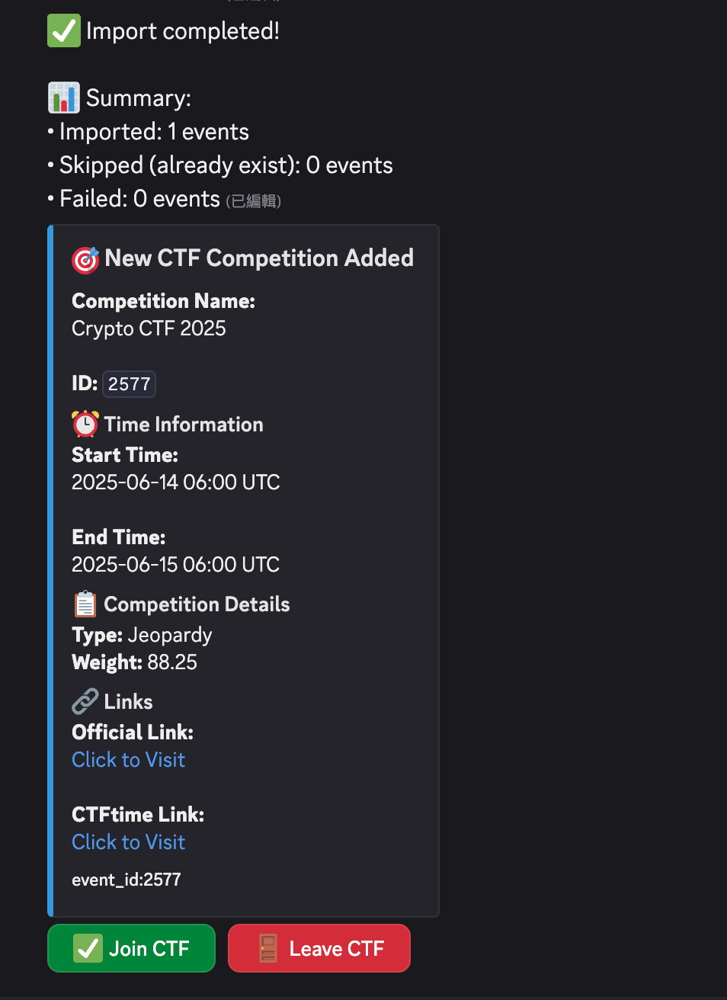

# Discord CTF Reminder Bot

A Discord bot that helps manage CTF competitions, including reminders, participant management, and timezone support.

## Features

- CTF competition management
  - Add competitions from CTFtime
  - List all competitions
  - Delete competitions
  - Join/leave competitions
  - View your participating competitions
- Automatic reminders
  - 24 hours before competition starts
  - When competition starts
- Timezone support
  - Set personal timezone
  - View time in your timezone
- Role management
  - Automatic role creation for competitions
  - Role assignment when joining competitions
- Utility commands
  - Base64 encoding/decoding
  - Ping test

## Installation

1. Clone the repository:
```bash
git clone https://github.com/yourusername/discord-ctf-remind-bot.git
cd discord-ctf-remind-bot
```

2. Create and activate virtual environment:
```bash
uv venv
```

3. Install dependencies using uv:
```bash
uv sync
```

4. Create `.env` file and add your Discord bot token:
```
DISCORD_TOKEN=your_bot_token_here
```

## Usage

1. Start the bot:
```bash
uv run new_main.py
```

2. Bot commands:
```
CTF:
  addctf       Add CTF competition to reminder list
  delctf       Delete specified CTF competition
  invitectf    Set or view competition invite link
  joinctf      Join CTF competition
  leavectf     Leave CTF competition
  listctf      List all added CTF competitions
  myctf        View all CTF competitions you're participating in
  participants View competition participants
Reminder:
  setremind    Set reminder times for a competition
Settings:
  setctftime   Set or view CTFtime team ID
  setnotify    Set notification channel for CTF events
  timezone     Set or view timezone
Utils:
  ping         Check bot's latency
​No Category:
  help         Shows this message

Type !help command for more info on a command.
You can also type !help category for more info on a category.
```



## Requirements

- Python 3.8+
- discord.py
- pytz
- requests
- python-dotenv

## License

MIT License
